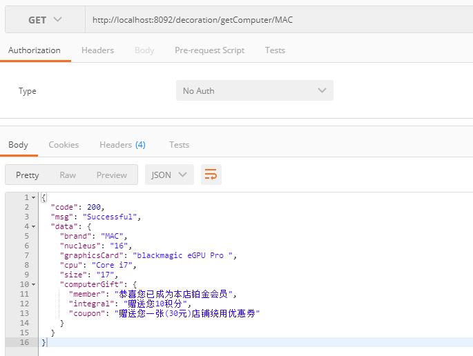

## Decoration Mode

本文主要讲解装饰者模式，进行实验模拟

##  需求讲解

- demo 背景

    模拟一个数码店，无论你买什么产品的电脑都是统一的赠品
    
- 开发前提
    
    产品分类：电脑，手机 ...

    
## 开发步骤

- 定义购买的XX接口 ComputerService
- 实现 ComputerService (ComputerServiceImpl / PhoneServiceImpl)
- 定义装饰者 Decorator，对ComputerService进行服务增强，这里是进行统一赠品的配置
- 模拟请求   http://localhost:8092/decoration/getComputer/MAC

这里装饰者对所有的产品进行了服务的增强，进行了统一赠品的添加，
无需去关系赠品，我们只需要关注产品即可
## 总结
装饰是增强，是辅助，目标仍然可以自行对外提供服务，装饰器只起增强作用。
