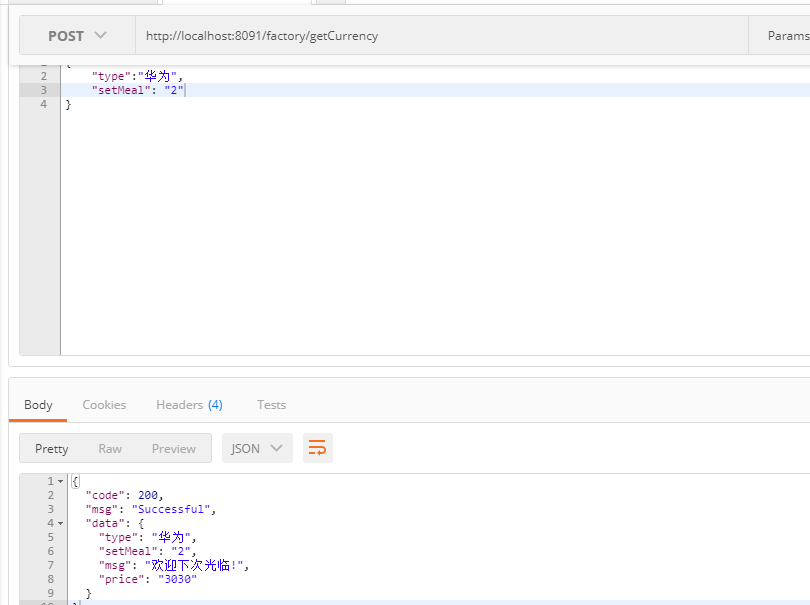

## Factory Mode

本文主要讲解工厂模式，进行实验模拟

##  需求讲解

- demo 背景

    模拟电商场景，有华为，苹果，小米等手机，根据不同的商品及套餐，获取商品信息
    本文只是模拟进行学习，场景也许不符合，主要进行思维学习
    
- 开发前提
    
    手机厂生产：华为，苹果，小米等手机
    
## 开发步骤

- 定义手机工厂适配接口 PhoneService
- 实现 PhoneService(HWServiceImpl / IPhoneServiceImpl ...) 
- 定义手机适配工厂 PhoneFactory
- 实现PhoneFactory (CurrencyFactory(通用工厂) / IPhoneFactory / HWPhoneFactory ...) 
- 模拟请求  
    通用:http://localhost:8091/factory/getCurrency

## 总结
从上面的实例中可以很容易看出来，工厂方法模式的重点就在这个工厂接口了。
目标可以无限扩展，工厂类也要随之扩展，一对一存在，满足了开闭原则，
但如果目标实现较多，工厂实现类也会增多，不简洁。

