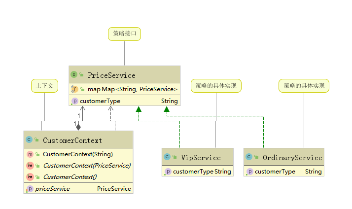
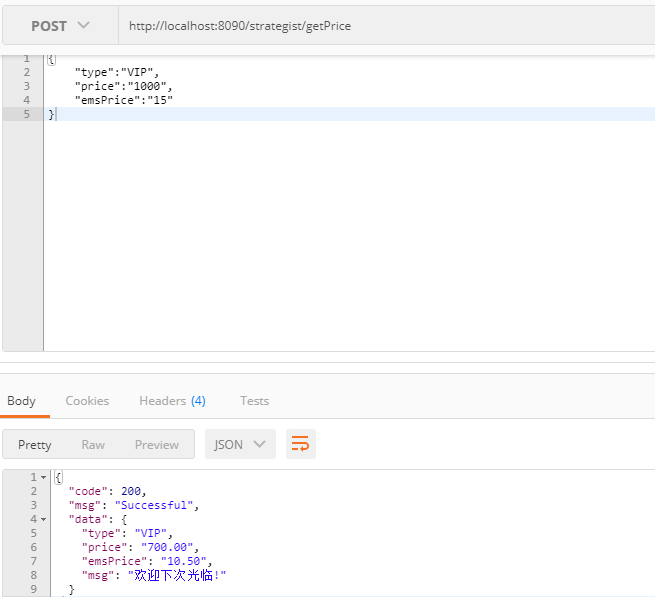

## Strategist Mode

本文主要讲解策略模式，进行实验模拟

##  需求讲解

- demo 背景

    模拟电商用户选择商品时的金额以及邮费计算，根据用户级别计算商品及邮费价格
    
- 开发前提
    
    用户分类：普通用户，VIP用户,VVIP用户
    
    费用计算模式：普通用户全额收取，VIP用户七折收取，VVIP用户五折收取
    
## 开发步骤

- 定义策略接口 PriceService
- 定义上文获取类 CustomerContext
- 实现策略接口，并继续费用计算(OrdinaryService / VipService)
- 结构图

- 模拟请求   http://localhost:8090/strategist/getPrice

这里以实现普通用户和VIP用户的开发，后续增加VVIP用户，或者更多用户，
只需要实现策略接口即可，对原来的需求不产生影响，实现了良好的可款展现

## 策略模式的主要角色如下
a） 抽象策略（Strategy）类：定义了一个公共接口，各种不同的算法以不同的方式实现这个接口，环境角色使用这个接口调用不同的算法，一般使用接口或抽象类实现。

b） 具体策略（Concrete Strategy）类：实现了抽象策略定义的接口，提供具体的算法实现。

c） 环境（Context）类：持有一个策略类的引用，最终给客户端调用。

