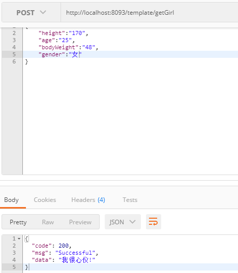
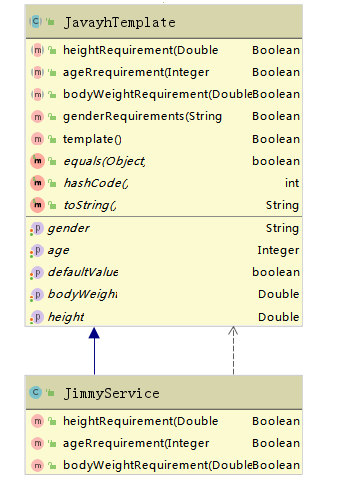

## template-mode

本文主要讲解模板模式，进行实验模拟

##  需求讲解

- demo 背景

    在当今社会，找对象是一个比较难得事情，找到合适的就更难了，很多人都有自己的要求
    
- 开发前提
    
    用户分类：找女/男朋友
    
    要求：身高、体重、年龄、工作、存款 ...
    
## 开发步骤

- 定义模板 JavayhTemplate
- 继承模板 JimmyService 这里做出具体的要求
- 模拟请求   http://localhost:8093/template/getGirl

## 模板方法模式包含以下主要角色

- 抽象类（Abstract Class）

负责给出一个算法的轮廓和骨架。它由一个模板方法和若干个基本方法构成。这些方法的定义如下：
>① 模板方法：定义了算法的骨架，按某种顺序调用其包含的基本方法。
>
>② 基本方法：是整个算法中的一个步骤，包含以下几种类型：
>
>a） 抽象方法：在抽象类中声明，由具体子类实现。
>
>b） 具体方法：在抽象类中已经实现，在具体子类中可以继承或重写它。
>
>c） 钩子方法：在抽象类中已经实现，包括用于判断的逻辑方法和需要子类重写的空方法两种。
- 具体子类（Concrete Class）

实现抽象类中所定义的抽象方法和钩子方法。

